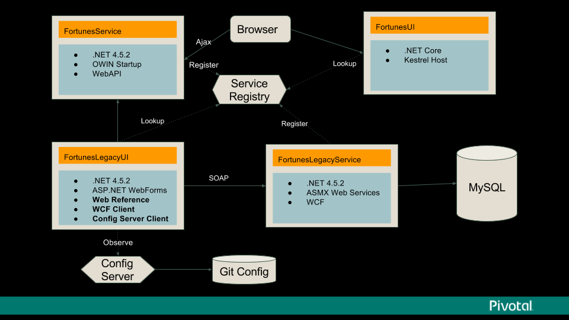

# PCF .NET Demo
This solution demonstrates the use of multiple microservices built using multiple .NET technologies and running on PCF. The primary goal is to show that PCF can handle legacy code that existed as early as .NET version 1.0, with common stacks introduced as part of .NET framework up to the newest .NET core application. The solution demonstrates a natural progression / evolution that a customer would take towards making their apps cloud native.

Technical Features Demonstrated:
- Running WebForms application
- Use of ASMX services
- WCF service connectivity
- OWIN bootstrap into IIS
- .NET core MVC application on Linux stack
- Service discovery via Eureka (using ASMX, WCF, and REST)
- MySQL connectivity using EntityFramework
- Config server with GIT repo

# Solution Projects
The solution revolves around a simple application that displays random quotes when a button is pressed. It also features a Kill command to simulate application failure.
* FortunesFormsUI - Web forms GUI. Depends on Eureka and Config Server. Depending on config value served by Config Server, the source of the messages shown will be switched between local in memory, ASMX service, WCF service, or REST
* ForunesLegacyService - Contains ASMX service and WCF service implementations for serving messages
   * ASMX fetches it's data from database connectivity via classic DataSet / DataAdapter approach
   * WCF featches data from database using a more modern approach using entity Framework
* FortunesServices - Rest based implementation using OWIN with WebAPI. Intended to be run on Windows stack with HWC
* FortunesUI - Modern .NET core version running on linux stack. Calls backend services directly from javascript.

# How to build
Run `\build\build.ps1`. The output will be dropped into `\publish\`
### Prerequisites
* Visual Studio 2017 with .NET core support

# How to deploy

* *Ensure that you have CF CLI as part of path, logged in, and targeting space/org where you want to deploy*

1. Run build\create-services.bat. Wait for services to finish being created (`cf services`)
2. Do `cf push` inside `\publish\` folder

## CI/CD with Visual Studio Team Services
Services must be precreated in target space. Run build\create-services.bat. Wait for services to finish being created (`cf services`)
1. Setup an VSTS space for your projects: https://www.visualstudio.com/team-services/
2. Create a project that will act as pipeline. Use `Git` as Version control
### Building
1. At the top of the menu, go to `Build & Release` and click `Import` button
2. Use `\deploy\vsts\build_definition.json` as source
3. In the proces steps (left side), click **Process** and for setting **Default Agent queue** select `Hosted VS2017` 
4. Click on **Get sources** link, pick **Remote Repo**, and click `Add connection`. For Server URL, set git URL where the repo is (https://github.com/macsux/pcfdemo.git or your forked version). Leave the rest of the settings as is.
5. Click **Triggers** on the menu. Disable CI or set polling timer to something reasonable.
6. Rename your build definition to `Fortunes` from `Fortunes-import`
7. Click **Save & queue** to trigger the build.
### Releasing
Before starting, visit the following links and install the required tasks into your VSTS account
* https://marketplace.visualstudio.com/items?itemName=ms-vsts.cloud-foundry-build-extension
* https://marketplace.visualstudio.com/items?itemName=automagically.DownloadFile
* https://marketplace.visualstudio.com/items?itemName=YodLabs.UnzipTask
1. At the top of the menu, go to `Build & Release` and click `Releases` button. If this is your first time doing it, do the next  steps to see full UI:
    1. Click **New definition**, and choose **Empty**
    2. Choose the build definition from previous step to be used as the source for this release and click **Create**
    3. Click save. Don't make any changes.
2. On the top left, click the + dropdown, and select `Import release definition`. Select `\deploy\vsts\release_definition.json` *NOTE: The rest of the instructions assumes you're using the new pipeline builder interface VSTS interface. As of writing it was an optional rollout*
3. Under artifacts, click Add. Select your project and build defition from **Building** step to configure the source of your artifacts.
3. Under `Run on agent`, for `Queue` select `Hosted VS2017`
4. Click on `Deploy Legacy UI` task, under Cloud Foundry Enpoint click configuration button. On next screen, create a new Service Enpoint of type `Generic`. Use full api endpoint as server URL, and your username & password.
5. Go back to previous screen, and select the newly configurated endpoint as Cloud Foundry Endpoint in the dropdown for the following steps:
   * Deploy Legacy UI
   * Deploy Legacy Services
   * Deploy Services
   * Deploy .NET Core UI
6. Go to Variables tab, and adjust the org / space to match the intended target
7. Save and Release

# Resources
**Slides:** https://goo.gl/RfFZQd
**Config Repo:** https://github.com/macsux/fortunesconfig
